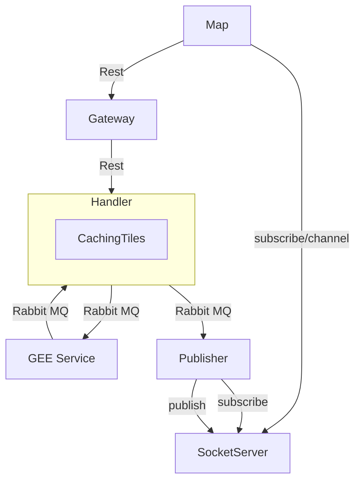
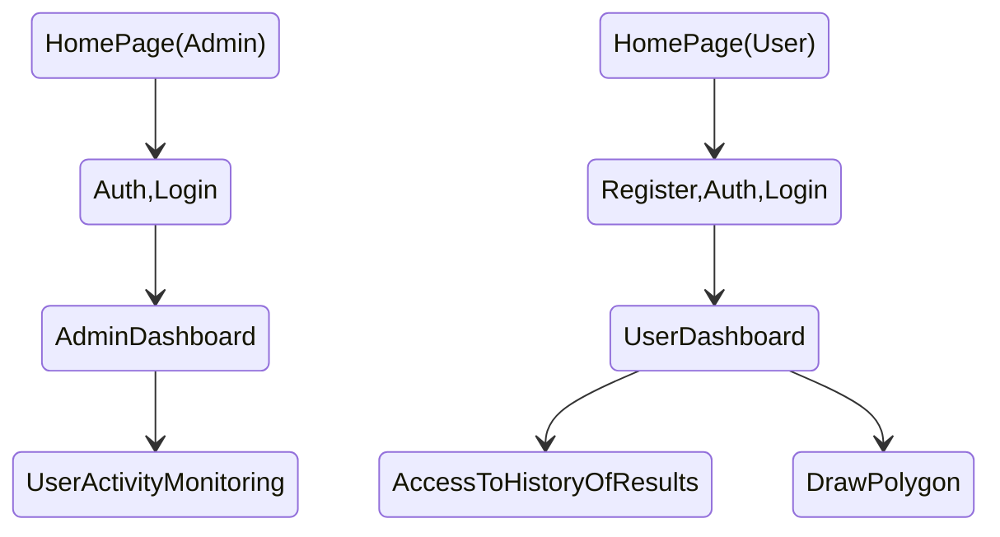

### Description
This project is Web application which assist farmer in farming operations.

### Diagram

### User flow

### Technologies

* :simple-django:{.grey} Django
* :simple-react:{.grey} React

### Team
* Ms. Moradi
* Mr. TalebElm