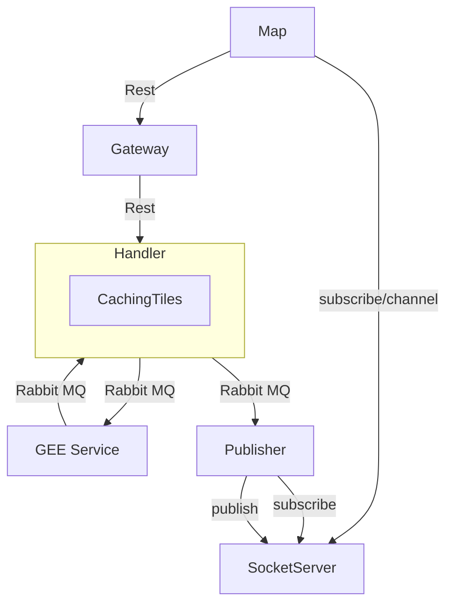
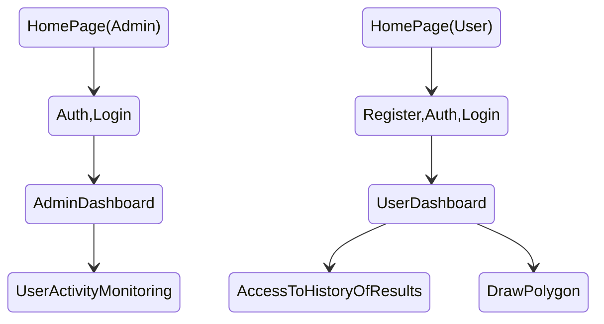

### Description
This project is Web application which assist farmer in farming operations.

### Diagram

### User flow

 

# Handler documentation
__Introduction
The handler service is actually a service that receives a request based on satellite images and then, according to the engines it has, processes the request and provides the result to the requester. (The client handler can be a user or another service. If the client is a normal user, he receives the response to his request on the front side. And if it is another service, he can receive the response to his request from the brokers)__

## Sub Project

* Map (Frontend). Implement via `react js`
* Farming (Backend). Implement via `django`
* Handler (Backend). Implement via `django`
* GEE (Backend). Implement via `python`
<!-- * SOE (Backend). Implement via `django` -->

## workflow
1- `Agricultural service`

_A: When a farmer or a farmer registers a land on the platform, he sends his request in the message structure. which first asks for a date range to see on which days there is an image for its field. The handler, for example, queries gee and creates an index for each date for the next processing request only in an empty form. On the front side, it is possible to receive the query of those dates according to the ID of the land and show them on the timeline._

_B: At this time, a request from the agricultural service is sent to the handler to receive the desired index image. The handler also sends the request to one of its engines such as gee for processing. After receiving the result from gee, it stores and sends the result for the sent request. (In order to display the result instantly in the user's browser, the result is sent through the socket)_

2- `image management service`

## models

Available in the `models.py` module

### GeeModel

This model is for when we intend to send a request to receive the ndvi index image or other indices from the handler. For this purpose, we send our request in a specific message structure. And the result is stored in the model. Of course, this model focuses on receiving the result (image) from Google Earth Engine.

| Key         | value         | required        | Description        |
| :---------: | :-----------: | :-------------: | :----------------: |
| `svc_type`  | NDVI          |:material-check: | To distinguish and separate the results by the handler       |
| `indicator` | Ndvi          |:material-check: | Quality index    |
| `filename`  | filename      |:material-check: | The name of the tile in Arvan cloud bucket to access and etc.             |
| `region`    | polygon       |:material-close: | Result area to use elastic query feature |
| `st_date`   | 2000-07-01  |:material-close: | start date         |
| `end_date`  | 2000-08-01  |:material-close: | end date           |
| `resources` | List(polygon) |:material-close: | sources and areas used for image mosaic  |
| `status`    | status_string   |:material-close: | status of process |

### ImageProcess

This model is actually a model that creates an instance for each image request to the handler. And finally, when the handler was able to determine the response and values of this request, it returns the response with its specified identifier.

|           Key                   | value         | required        | Description        |
| :---------: | :-----------: | :-------------: | :----------------: |
| `image_id`  | uuid          |:material-check: | Request ID         |
| `indicator` | Ndvi          |:material-check: | Quality index      |
| `image_region` | polygon    |:material-check: | Request area        |
| `st_date`    | 2000-07-01   |:material-close: | start date |
| `end_date`   | 2000-08-01   |:material-close: | end date        |
| `image_base64`  | Base64_string  |:material-close: | Base64 image       |
| `image_values` | List[] |:material-close: | Dataset value of pixel points |
| `mean_value`    | 2.3   |:material-close: | Average values |
| `resources` | List(polygon) |:material-close: | sources and areas used for image mosaic  |
| `status`    | status_string   |:material-close: | status of process |

### FarmModel

This model is actually for the time when a farmer or industrialist plans to register a land with his desired name.

|           Key                   | value         | required        | Description        |
| :-----------------------------: | :-----------: | :-------------: | :----------------: |
| `farm_name`                     | Phone+uuid    |:material-check: | Farm name          |
| `farm_region`                   | polygon       |:material-check: | Farm region        |
| `centroid`                      | (Lat,long)    |:material-check: | central point      |

### FarmResultModel

These documents are created by the handler when the dates are received from gee.
Any agricultural user in his timeline can request any of these documents whose status is not completed so that the results are processed and their information is available with active status.

|           Key                   | value         | required        | Description        |
| :-----------------------------: | :-----------: | :-------------: | :----------------: |
| `farm_id`                       | Phone+uuid    |:material-check: | Farm id            |
| `indicator`                     | Ndvi          |:material-check: | Quality index      |
| `farm_date`                     | 2000-06-18    |:material-close: | date               |
| `farm_image`                    | Base64_string |:material-close: | Base64 image       |
| `farm_values`                   | list()        |:material-close: | Dataset value of pixel points |
| `min_value`                     | 2.7           |:material-close: | Average values     |
| `status`                        | status_string |:material-close: | status of process  |

### FarmDatesModel

When the farmer registers his land, a request is sent to the handler, and the handler inquires about the date of the available images of that land from gee or etc.

This model is temporarily used by the handler and etc.

|           Key                   | value         | required        | Description        |
| :-----------------------------: | :-----------: | :-------------: | :----------------: |
| `farm_id`                       | Phone+uuid    |:material-check: | Farm id            |
| `svc_type`                      | type          |:material-check: | The type of service that must be specified for the handler |
| `dates`                         | list(date,..)    |:material-close: | all dates available image                             |

## Sample requests (message structure)

### Request types

This value can be accessed and selected from the `HANDLER_REQ` class of enumeration data type. which is available in the `utils` module. Currently, it includes the following value:

   `RASTER_DATA` = 1

   `DATES` = 2

### Indicators

This value can be accessed and selected from the `HANDLER_INDICATOR` class of enumeration data type. which is available in the `utils` module. Currently, it includes the following value:

   `NDVI` = 1

## Search mechanisms

The types of search engines are as follows:

- When the handler receives a new request, does it check whether it has already received a part of the requested area or the whole of it? If the entire area already has a request, it will process the request immediately and send the result to the user. Otherwise, if the area is not available, it puts the request in the processing queue to be processed with other requests.

- When the handler, for example, receives a response from gee in response to its processing request, it first searches and filters the commonality of that response with the requests being processed by the handler. It then searches each of those requests again with all available processing results and responses to see if it can complete and satisfy the requested area. If it succeeds, it will calculate the result and after merge and clip etc., it will send that result to the user. (Note that only those results that have a successful status are searched. Also, the results are filtered according to the required date)

- When the handler receives a result from gee, the actual result of the processing may not be complete. (due to the mosaic of current images). For this purpose, he should make a query so that the required results are requested from gee again.

## Checking the images and ready results is done only in 2 times:

- When a new request is received by the handler: the handler searches whether it can answer this request or not. If it has a cache, it returns the request and returns its response.

- When the handler receives a response from gee or another engine, it searches among the requests being processed and checks which of the requested areas has something in common with the received response. Then, for each subquery, it searches through its own results to see if it can answer the entire current request area. If it can answer the request area, it will store and send the answer to the user's request at the same stage. Otherwise, the user's request remains in processing. (This expectation is reasonable only when it is ensured that the requested non-existent regions are being processed)

## Getting to know the `rasterlib` module

This module is used to merge the image tiles which are usually in tiff format, then cut and clip the specific requested area and finally receive the image output in png format.
It includes different sections:

`merge_tiles`: In the first argument, this function receives a list of image tile sources in tiff format, then stores the merged result in the path of the second received argument.

`merge`: `merge_tiles` function uses this function to merge its images first.

`extract_values`: This function stores raster values for geographic location and similar values, also calculates the mean of values such as ndvi.

`export_ndvi`: This function reads the ndvi results according to the received dataset (tiff file) and then assigns them a color palette in the range of 0 to 1. And finally, it stores the png file in the received destination address.

`generate_tile`: This function generally simultaneously `merge_tiles`, then cuts and extracts the requested area on the merged tile. Finally, using the `export_ndvi` function, the result of the png image is stored in ndvi. Finally, it can convert the resulting image to `base_encode64` using the `base64_image` function and use it.

## Getting to know the `receiver` module

This is the same gee service.

### Setting up :

`At first, this service creates a process using the licenses it has obtained from gee. So that each license is related to one process. When it receives a new request from its connection queue, it divides the new requests among the processes in order so that it can perform several processes at the same time and the process does not stop.`

{==Procedures for obtaining a new license from Google Earth Engine==}

### Tasks :

- gee must try a certain number of times for each request, for example 4 times, to receive the result and send it to the handler. If it still fails to process after these attempts, it should still report the failure result. (The handler takes the appropriate decision after receiving the processing status.)
- gee must be able to remain stable and store its logs in case of errors and emergency situations. (be ready for all restrictions)
- It must have access to several licenses and be able to behave in such a way that it is not recognized by gee as an abuser, and on the other hand, it must be able to use all its processing power and at a reasonable speed.

## Getting to know the `processing` module

This module interacts with Google Earth through REST.

It includes various `processing` functions:

- `get_ndvi`: the gee service calculates the ndvi index of the requested image (operations such as cloud mask on the image with clouds, image mosaic, etc.) and sends the result to the handler in the form of a tiff file. The handler also caches it, and responds to common area requests if possible (in tiff file format).
- `get_date_list`: In this function, the collection of sentinel2 images are filtered based on the received area and received date range. And then the date of the available images are returned as a list.
The rest of the functions are more helpful to the mentioned functions. For example, the functions used for the cloud mask and...

## Getting to know the `bucket` module

This module contains various parts for using object storage.
At first, in the constructor function, according to the values in the `setting` module, it creates a connection with the bucket or object storage.

`DownUploadFile`: receives a source file address and destination file name as input. It receives the file from the sending source and stores it in the bucket with the output name.

`GetDownloadLink`: By receiving the file name and an expiration time, it creates a temporary address to access the desired private file.

## Getting to know the `Elastic` module

This module contains different parts for using elastic.
Contains the ElasticManager class. When using this class, it automatically reads the elastic connection address from the settings module and creates a connection through it with elastic.
It includes the following functions:

`insert_to`: This function receives parameters such as uuid, document and index, and then storage is done based on the received parameters.

`Insert`: This function only receives the document and index from the input and saves it. (for times when the ID is not important to us or we intend to use a suitable unique ID)

`Get`: This function receives the uuid and index from the input, then returns the result in the output.

`Search`: this function, query as a dictionary; It also receives the index from the input, then returns the result in the output.

`create_index`: This function creates the desired index in Elastic according to the name of the index and the custom mapping it receives.

## Getting to know the `gee_custom_query` module

This module contains the set of custom queries needed and used for gee:
It has a class named `GeeCustomQueries`, which when created is an object of the `GeeModel` model, based on which the desired queries can be made.

It includes the following queries:

`search_by_uuid`: performs the query based on the document ID in the gee index.
`polygon_within` : Used for area query. It receives the coordinates of the area in the form of a polygon, date and index as an input for querying and can be used for combined search.

## Introduction to `base64_encode` module
This module has a class called `ImageManager`, which can be obtained using the `get_base64_png` function and calling it with the input value of the path of the png image file, that image file can be received as a base64 string.

Getting to know the `settings` module
This module has the required values for authentication in the bucket service, elastic search, etc.

## Technologies

* :simple-django:{.grey} Django
* :simple-react:{.grey} React
* :simple-redis:{.grey} Redis :

    In order for the gateway to be able to allow each user at any time, only one request being processed, it needs to consider a variable in the Redis cache for the ID of that user and the value of the processing status or etc. the handler also has access to this value, and if in its review, it finds that the processing time of this user has expired, it updates the result and deletes it from the cache. The gateway also accepts the new request from the user and sends it to the handler if it sees that the user is not processing the request.
      

* :simple-rabbitmq:{.grey} RabbitMQ : 

    - When the handler intends to send a request to its engines for processing, it adds it to their processing queue as a task.

    - When the engines want to inform the handler of the processing request status, they add a new item to the handler's processing result queue. By ensuring the successful status of the received result, the handler can respond to the shared requests it is processing.

    - When the handler wants to send a result to the users through the socket, it sends the new message to the publisher's rabbit queue along with the process id that the user listens to.

* :simple-elastic:{.grey} Elastic Search :

    All the models related to the handler service are stored in Elastic Search in order to use the possibility of suitable queries that it provides us.
      

* :simple-celery:{.grey} Celery : 

    We use this possibility to avoid blocking and stop processing for each processing request, as well as proper management of threads and processes. Our tasks are also specified in the tasks module. and are accessible.
      

## How to communicate
- Storage and cache: bucket, elastic
- Search: elastic search
- Response: RabbitMQ and socket cluster
- Storage of events: log and etc

## Team
* Ms. Moradi
* Mr. TalebElm