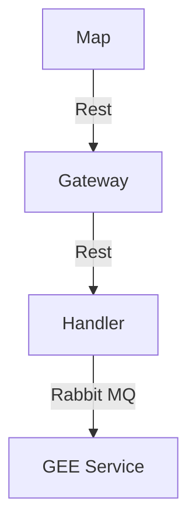
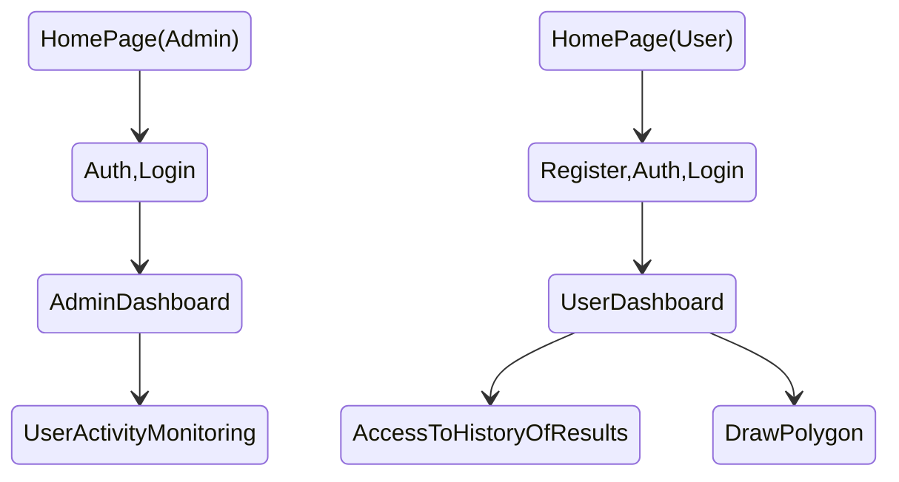

### Description
This project is Web application which assist farmer in farming operations.

### Diagram

``` mermaid
flowchart TB
    
    Map --Rest--> Gateway
    Gateway --Rest--> Handler
    Handler --Rabbit MQ--> A[GEE Service]

    
``` 

### User flow

```mermaid
    stateDiagram-v2

    HomePage(Admin) --> Auth,Login
    Auth,Login --> AdminDashboard
    AdminDashboard --> UserActivityMonitoring

    HomePage(User) --> Register,Auth,Login
    Register,Auth,Login --> UserDashboard
    UserDashboard --> AccessToHistoryOfResults
    UserDashboard --> DrawPolygon


```

### Technologies

* Django
* React

### Team
* Ms. Moradi
* Mr. TalebElm