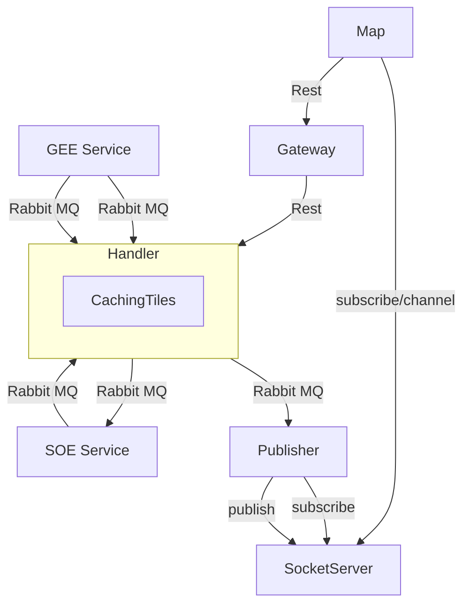
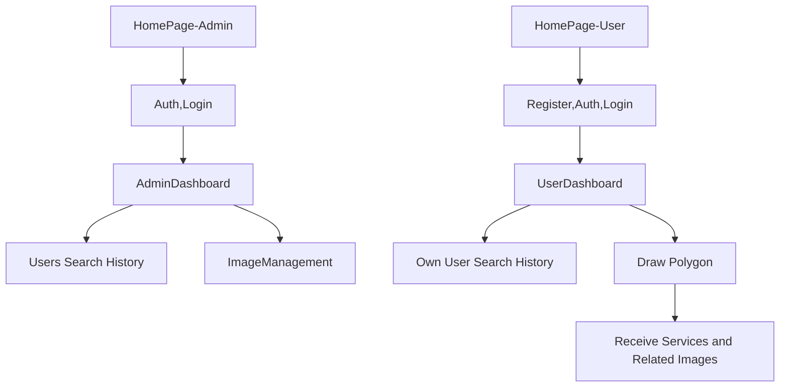

### Description
This project is Web application which manage map tile and drawing operations for farming purpose.

### Diagram

``` mermaid
flowchart TB
    

    
    subgraph Handler
        CachingTiles
    end

    Map --subscribe/channel--> SocketServer
    Map --Rest--> Gateway
    Gateway --Rest--> Handler
    Handler --Rabbit MQ--> A[SOE Service]
    B[GEE Service] --Rabbit MQ--> Handler
    Handler --Rabbit MQ--> Publisher
    Publisher --subscribe--> SocketServer    
    Publisher --publish--> SocketServer
    A[SOE Service] --Rabbit MQ--> Handler
    B[GEE Service] --Rabbit MQ--> Handler
    

    
```

### User flow

```mermaid
    flowchart TB

    E[HomePage-Admin] --> Auth,Login
    Auth,Login --> AdminDashboard
    AdminDashboard --> H[Users Search History]
    AdminDashboard --> ImageManagement

    F[HomePage-User] --> Register,Auth,Login
    Register,Auth,Login --> UserDashboard
    UserDashboard --> G[Own User Search History]
    UserDashboard --> I[Draw Polygon]
    I --> D[Receive Services and Related Images]

```

### Team
* Ms. Sabahi
