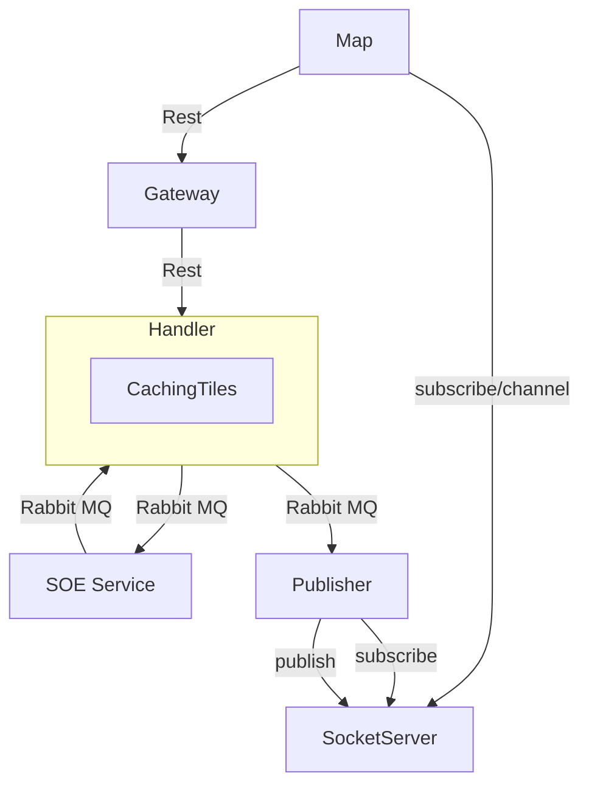
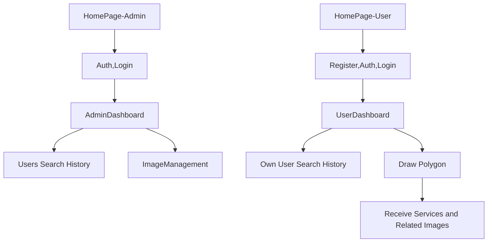

### Description
This project is Web application which manage map tile and drawing operations for farming purpose.

### Diagram

### User flow

## Sub Project

* Map (Frontend). Implement via `react js`
* SOE (Backend). Implement via `fastapi`

### Image Collection

Elastic image index for storing images

|           Key                   | type         | required        | Description        |
| :---------: | :-----------: | :-------------: | :----------------: |
| `image_id`  | text          |:material-check: | image id in its metadata        |
| `acquisition-time` | date          |:material-check: |   date of image acquisition    |
| `image-corners` | geo_shape    |:material-check: |  image corners    |
| `owner`    | text   |:material-check: | owner of the image |
| `platform-type`   | text   |:material-check: | platform type of image acquisition (it can be satellite, drone or airplane)    |
| `platform-name`  | text  |:material-check: | platform name of image acquisition |
| `sensor-type` | text |:material-check: | sensor type of image acquisition (it can be RGB, PAN, ...) |
| `filename`    | text   |:material-check: | filename of the image |
| `resolution` | text |:material-check: | resolution of image  |

### Image Sources
Elastic index for storing image sources to search the image sources faster

|           Key                   | type         | required        | Description        |
| :---------: | :-----------: | :-------------: | :----------------: |
| `owner`    | text   |:material-check: | owner of the image |
| `platform-type`   | text   |:material-check: | platform type of image acquisition (it can be satellite, drone or airplane)    |
| `platform-name`  | text  |:material-check: | platform name of image acquisition |
| `cumulative-polygon` | geo_shape |:material-check: | The area where we have the image  |

### Search Collection
Elastic index for storing users searches

|           Key                   | type         | required        | Description        |
| :---------: | :-----------: | :-------------: | :----------------: |
| `user_id`    | text   |:material-check: | user id |
| `timestamp`   | date   |:material-check: |    |
| `polygon` | text |:material-check: | The area where the user searched  |

### SOE API

It has three main routes

* /explore-image : get a polygon from the user and returns the images that intersects with the input polygon.
* /searches-history : return 10 latest searches
* /images-source-categories : returns image sources

### Team
* Ms. Sabahi
