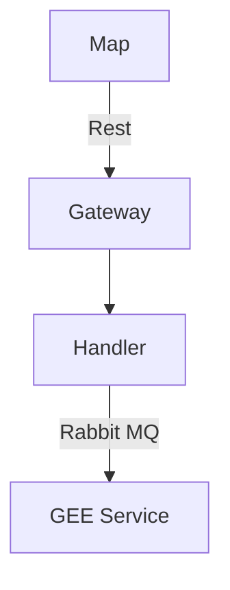
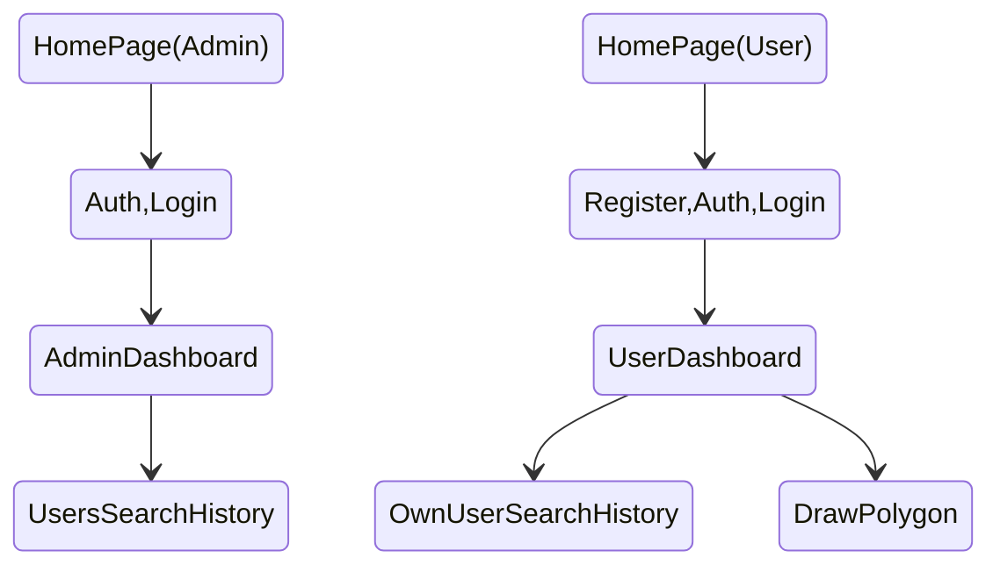

### Description
This project is Web application which manage map tile and drawing operations for farming purpose.

### Diagram

### Technologies

* :simple-django:{.grey} Django
* :simple-react:{.grey} React

### User flow

### Team
* Ms. Sabahi
