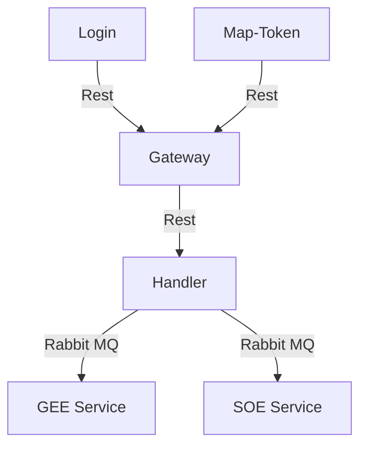
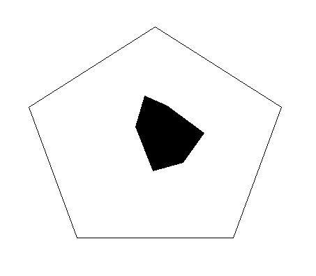
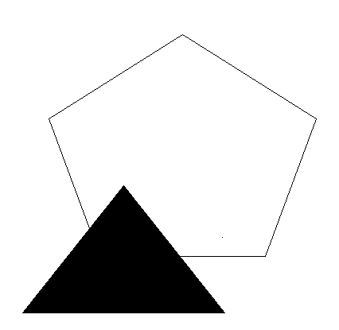
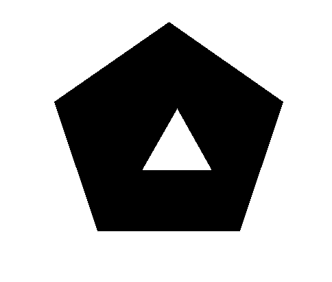
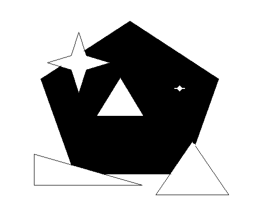
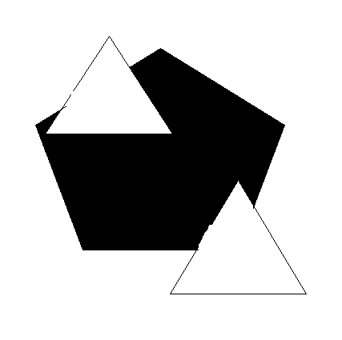
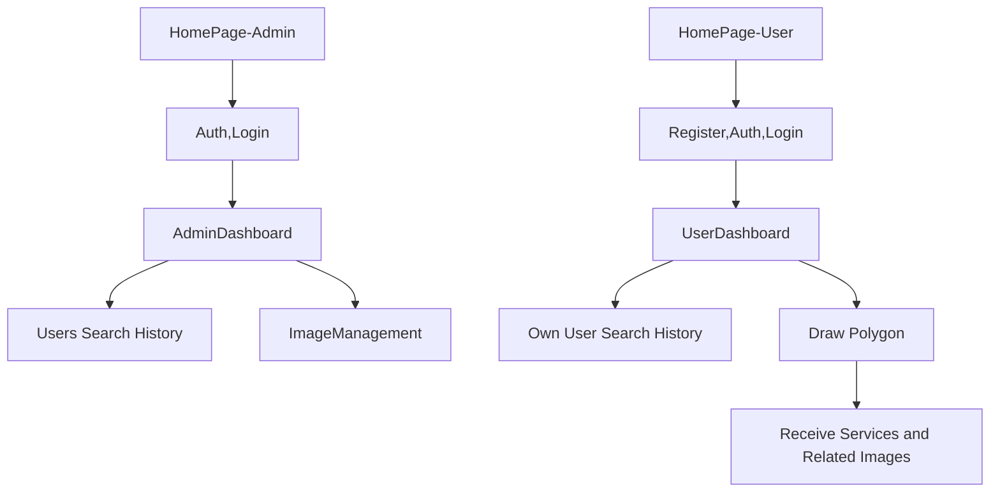

### Description
This project is Web application which manage map tile and drawing operations for farming purpose.

### Diagram

### Detailed Design

* `Handler`

:   First State : The requested data(black polygon) places completely in one of the available data(white polygon).

    <figure markdown>
        { width="200" }
    <figcaption>First State</figcaption>
    </figure>

:   Second State : The requested data(black polygon) intersects with one of the available data(white polygon).

    <figure markdown>
        { width="200" }
    <figcaption>Second State</figcaption>
    </figure>

:   Third State : The requested data(black polygon) surrounds one of the available data(white polygon).

    <figure markdown>
        { width="200" }
    <figcaption>Third State</figcaption>
    </figure>

:   Forth State : The requested data(black polygon) surrounds multiple available data(white polygon).

    <figure markdown>
        { width="200" }
    <figcaption>Forth State</figcaption>
    </figure>

:   Fifth State : The requested data(black polygon) surrounds and intersects with multiple available data(white polygon).

    <figure markdown>
        { width="200" }
    <figcaption>Fifth State</figcaption>
    </figure>

:   Sixth State : The requested data(black polygon) intersects with multiple available data(white polygon) -> It's like the.

    <figure markdown>
        { width="200" }
    <figcaption>Sixth State</figcaption>
    </figure>

### Technologies

* :simple-django:{.grey} Django
* :simple-react:{.grey} React

### User flow

### Team
* Ms. Sabahi
